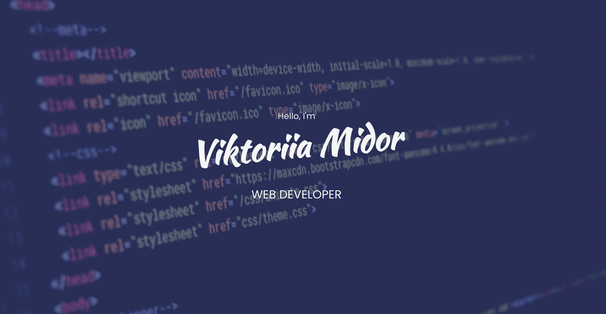
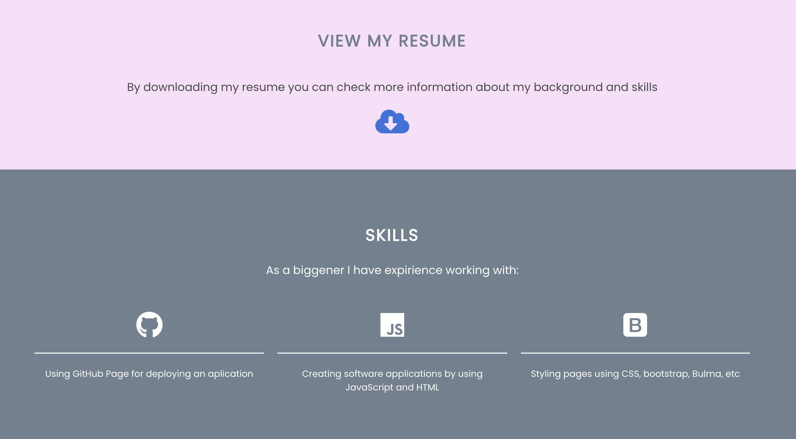
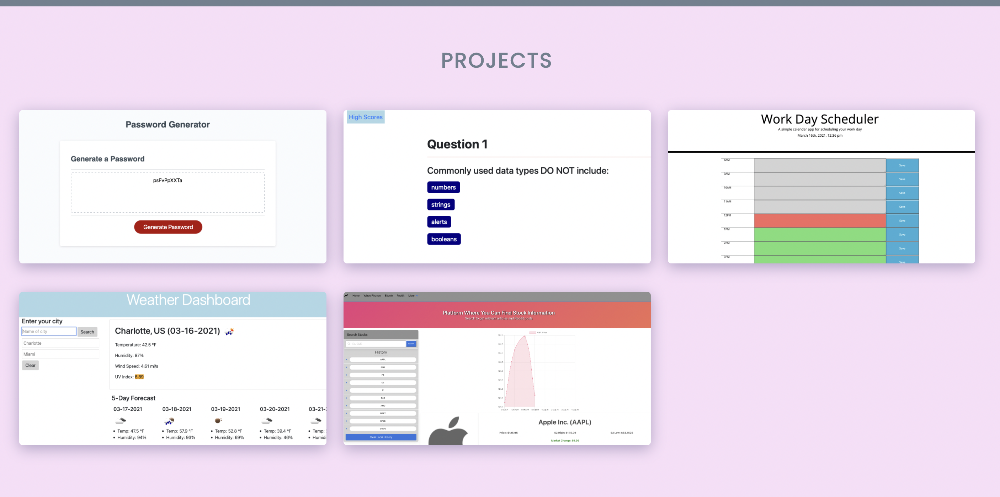

# Updated-portfolio
Application was built using HTML, CSS, Bulma,Fontawesome.com and AOS.CSS. 

# Functions 

Whenever you click on header info it will take you to that particular section on the webpage or will open requested page (GitHub, resume or LinkedIn)
Size will be adapted by most of the viewports.

Also you can see my recent projects, clicking them user will be displayed to the actual project. 

